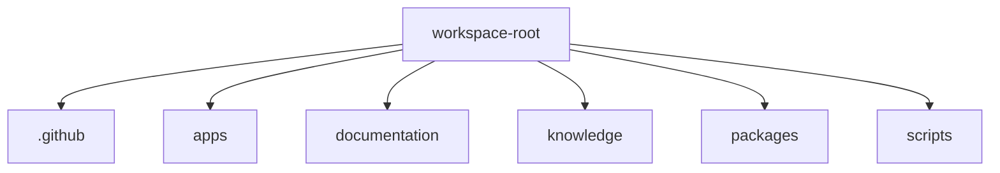

# Project Graph

- Workspace root: `D:\Aayush_Acharya\GitFlow`
- Snapshot: `d6c5713`
- Folders indexed: **268**
- Files indexed: **1355**
- Import edges: **988**
- RAG chunks: **7939**

## Top-level domains

- [[notes/folders/.github|.github]]
- [[notes/folders/apps|apps]]
- [[notes/folders/documentation|documentation]]
- [[notes/folders/knowledge|knowledge]]
- [[notes/folders/packages|packages]]
- [[notes/folders/scripts|scripts]]

## Mermaid topology

## Notes

- Full folder and file notes are generated under `notes/folders` and `notes/files`.
- Import edges are generated from relative imports in JS/TS files.
- Use Obsidian Graph View for a full interactive dependency and structure graph.
